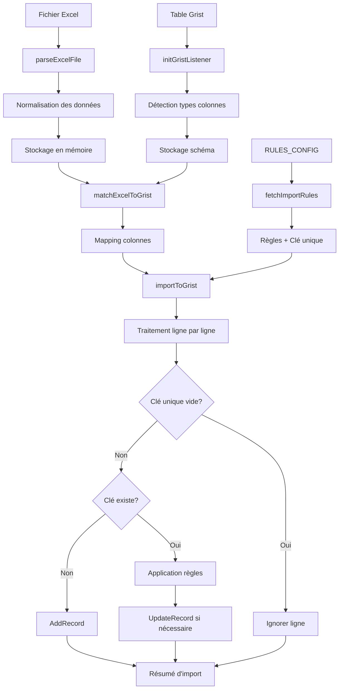

# 📥 Grist Import Widget

Un widget d'importation Excel → Grist intelligent avec gestion des règles de duplication et mapping automatique des colonnes.

## 🎯 Vue d'ensemble

Ce projet est un widget Grist qui permet d'importer des données Excel (.xlsx) dans une table Grist en appliquant des règles de gestion des doublons configurables. Il automatise le processus d'import en mappant intelligemment les colonnes Excel vers les colonnes Grist et en appliquant des stratégies de mise à jour personnalisées.

### ✨ Fonctionnalités principales

- **📊 Import Excel**: Support des fichiers .xlsx avec prévisualisation des données
- **🔄 Mapping automatique**: Correspondance intelligente entre colonnes Excel et Grist (normalisation des noms)
- **⚙️ Règles configurables**: 6 types de règles d'import personnalisables par colonne
- **🔑 Gestion des doublons**: Détection et traitement via clé unique configurable
- **🎮 Interface multi-mode**: Mode utilisateur, admin et développement
- **📋 Prévisualisation**: Simulation des changements avant application
- **📈 Résumé détaillé**: Rapport ligne par ligne des opérations effectuées

## 🏗️ Architecture

### Structure des fichiers

```
grist-import-widget/
├── index.html              # Interface utilisateur principale
├── app.js                  # Point d'entrée et orchestration
├── server/
│   ├── server.js           # Serveur Express pour développement
│   └── package.json        # Dépendances serveur
├── services/
│   ├── gristService.js     # Communication avec l'API Grist
│   ├── excelService.js     # Traitement des fichiers Excel
│   ├── uiService.js        # Gestion de l'interface utilisateur
│   └── gristRules.js       # Gestion des règles d'import
│
├── config.js               # Configuration des règles de duplication
├── adminTools.js          # Outils d'administration et débogage
├── styles/
│   └── style.css           # Styles CSS
└── assets/
    └── logo-FT.png         # Ressources visuelles
```

### Modules principaux

#### 🎛️ `app.js` - Orchestrateur principal

- Gestion des modes d'affichage (public/admin/dev)
- Coordination des événements UI
- Orchestration du flux d'import

#### 📊 `gristService.js` - Interface Grist

- Communication avec l'API Grist (Plugin API)
- Détection automatique des types de colonnes
- Application des actions de mise à jour
- Prévisualisation des changements

#### 📋 `excelService.js` - Traitement Excel

- Parsing des fichiers .xlsx via SheetJS
- Normalisation des données
- Mapping automatique des colonnes

#### 🎨 `uiService.js` - Interface utilisateur

- Rendu des prévisualisations
- Gestion des formulaires de configuration
- Affichage des résultats d'import

## 🔧 Installation et configuration

### Prérequis

- Serveur web (pour servir les fichiers statiques)
- Document Grist avec accès "full" pour les widgets
- Navigateur moderne avec support ES6 modules

### Installation

1. **Cloner le repository**

```bash
git clone [url-du-repo]
cd grist-import-widget
```

2. **Lancer le serveur de développement**

```bash
cd server
npm install
npm start
```

Le serveur sera accessible sur `http://localhost:8000` (développement local)

3. **Intégrer dans Grist**
   - Créer un widget personnalisé dans votre document Grist
   - URL: `http://localhost:8000` (développement local) ou l'URL de votre hébergement
   - Accès requis: "full"

### Configuration initiale

Le widget créera automatiquement une table `RULES_CONFIG` lors du premier usage en mode admin :

| Colonne  | Type | Description                                |
| -------- | ---- | ------------------------------------------ |
| col_name | Text | Nom de la colonne dans la table cible      |
| rule     | Text | Règle d'import appliquée                   |
| is_key   | Bool | Indique si cette colonne est la clé unique |

## 📖 Guide d'utilisation

### 🎮 Modes d'utilisation

Le widget propose trois modes selon le profil utilisateur :

#### 👤 Mode Public (Utilisateur final)

Interface simplifiée pour l'import quotidien :

- Upload de fichier Excel
- Lancement de l'import avec les règles pré-configurées
- Visualisation du résumé d'import

#### ⚙️ Mode Admin (Configuration)

Interface complète pour la configuration :

- Gestion des règles par colonne
- Configuration de la clé unique
- Sauvegarde des paramètres dans Grist

#### 🔧 Mode Dev (Développement)

Interface de débogage :

- Prévisualisation des données Excel
- Inspection du mapping des colonnes
- Logs détaillés des opérations

### 🔄 Processus d'import

1. **📄 Upload du fichier Excel**

   - Sélection du fichier .xlsx
   - Parsing automatique de la première feuille
   - Normalisation des données

2. **🔗 Mapping automatique**

   - Correspondance intelligente des noms de colonnes
   - Normalisation (suppression accents, espaces, caractères spéciaux)
   - Prévisualisation des correspondances

3. **⚙️ Application des règles**

   - Récupération des règles depuis `RULES_CONFIG`
   - Identification de la clé unique
   - Traitement ligne par ligne

4. **💾 Import et mise à jour**
   - Détection des doublons via clé unique
   - Application des règles de duplication
   - Mise à jour de la table Grist

## 🎯 Règles de duplication

Le système propose 6 types de règles configurables par colonne :

### ❌ `ignore` - Ne jamais modifier

La valeur Grist est toujours conservée, même si différente d'Excel.
**Cas d'usage** : Champs calculés ou validés manuellement

### ✏️ `overwrite` - Écraser systématiquement

La valeur Excel remplace celle de Grist à chaque import.
**Cas d'usage** : Données de référence provenant d'Excel

### 📅 `update_if_newer` - Mettre à jour si plus récent

La valeur Excel remplace celle de Grist uniquement si elle est plus récente (comparaison de dates).
**Cas d'usage** : Horodatages, dates de modification

### 🧩 `fill_if_empty` - Remplir uniquement si vide _(À implémenter)_

La valeur Excel est utilisée uniquement si la cellule Grist est vide.
**Cas d'usage** : Valeurs par défaut

### 🔒 `preserve_if_not_empty` - Ne modifier que si vide _(À implémenter)_

Identique à `fill_if_empty` (alias pour la clarté).

### ➕ `append_if_different` - Ajouter si différent _(À implémenter)_

La valeur Excel est ajoutée à la suite si elle est différente de celle de Grist.
**Cas d'usage** : Champs de commentaires, historique

## 🔑 Gestion des clés uniques

### Configuration

- Une seule colonne peut être définie comme clé unique
- Configurée via la colonne `is_key` dans `RULES_CONFIG`
- Changeable dynamiquement en mode admin

### Comportement

- **Lignes avec clé vide** : Ignorées automatiquement
- **Clé existante** : Application des règles de duplication
- **Nouvelle clé** : Création d'un nouveau record

## 🔄 Flux de données détaillé



## 🛠️ API et fonctions principales

### GristService

```javascript
// Initialisation de l'écoute Grist
initGristListener(callback);

// Import des données
importToGrist({ excelData, mapping, tableId });

// Récupération des types de colonnes
getGristColumnTypes();
```

### ExcelService

```javascript
// Parsing d'un fichier Excel
parseExcelFile(file, callback);

// Mapping automatique des colonnes
matchExcelToGrist(excelCols, gristCols);
```

### UIService

```javascript
// Rendu de la prévisualisation
renderPreview(data);

// Mise à jour de l'interface de mapping
updateMappingUI(mapping);

// Interface d'administration des règles
initAdminRulesUI();
```

## 🔍 Debugging et logging

Le widget inclut un système de logging complet :

### AdminTools

- Interception de tous les appels `applyUserActions`
- Stack traces pour le débogage
- Logs formatés avec emojis pour la lisibilité

### Console logs

- 📥 Données reçues de Grist
- 🧠 Types de colonnes détectés
- 🔁 Mapping des colonnes
- ⚙️ Règles appliquées
- 📤 Actions envoyées à Grist
- 📋 Résumé détaillé de l'import

## ⚡ Optimisations et performances

### Traitement des données

- **Normalisation unique** : Les noms de colonnes ne sont normalisés qu'une fois
- **Indexation** : Création d'un index des données Grist par clé unique
- **Traitement par lot** : Toutes les actions sont groupées en une seule requête

### Gestion mémoire

- **Stockage temporaire** : Les données Excel sont stockées en mémoire pendant la session
- **Nettoyage automatique** : Réinitialisation à chaque nouvel upload

### Interface utilisateur

- **Rendu conditionnel** : Seules les sections nécessaires sont affichées selon le mode
- **Prévisualisation limitée** : Affichage tabulaire optimisé pour de gros volumes

## 🐛 Gestion des erreurs

### Cas d'erreur gérés

- **Fichier Excel invalide** : Message d'erreur explicite
- **Table RULES_CONFIG manquante** : Création automatique
- **Clé unique non définie** : Alerte utilisateur
- **Échec de communication Grist** : Logs détaillés

### Messages utilisateur

- **✅ Succès** : Résumé détaillé avec statistiques
- **⚠️ Avertissements** : Lignes ignorées avec raison
- **❌ Erreurs** : Messages explicites avec guidance

## 🔮 Limitations et améliorations futures

### Limitations actuelles

- **Format unique** : Support uniquement des fichiers .xlsx
- **Première feuille** : Seule la première feuille Excel est lue
- **Types simples** : Détection basique des types de colonnes Grist
- **Règles partielles** : 3/6 règles implémentées

### Roadmap

- [ ] Support multi-feuilles Excel
- [ ] Implémentation des règles manquantes (`fill_if_empty`, `append_if_different`)
- [ ] Interface de sélection de feuille
- [ ] Export des configurations
- [ ] Système de rollback
- [ ] Support des formats CSV

## 👥 Contribution

### Structure de développement

- **Modules ES6** : Organisation modulaire claire
- **Séparation des responsabilités** : Chaque service a un rôle précis
- **Configuration centralisée** : `config.js` pour les paramètres

### Tests

- Fichier de mock : `tests/gristTableMock.js`
- Tests à développer pour chaque module

### Convention de code

- **Emojis dans les logs** : Pour une meilleure lisibilité
- **Commentaires français** : Documentation en français
- **Nommage explicite** : Fonctions et variables auto-documentées

## 📝 Notes techniques

### Dépendances externes

- **Grist Plugin API** : `https://docs.getgrist.com/grist-plugin-api.js`
- **SheetJS** : `https://cdn.sheetjs.com/xlsx-latest/package/dist/xlsx.full.min.js`
- **Express** : Serveur de développement local

### Compatibilité

- **Navigateurs modernes** : ES6 modules requis
- **Grist** : Plugin API v1.0+
- **Excel** : Format .xlsx (Office 2007+)

### Sécurité

- **Accès full requis** : Nécessaire pour la lecture/écriture des tables
- **Validation côté client** : Vérification des données avant envoi
- **Logs de traçabilité** : Toutes les actions sont tracées

## 📞 Support

### En cas de problème

1. **Vérifier les logs** : Console du navigateur pour les détails
2. **Mode dev** : Utiliser pour diagnostiquer les mappings
3. **RULES_CONFIG** : Vérifier la configuration des règles
4. **Permissions** : S'assurer que le widget a l'accès "full"

### Structure de logs

```
📥 Grist → Données reçues : [array of records]
🧠 Types de colonnes (déduits) : {column: type}
🔁 Mapping détecté : {excelCol: gristCol}
📜 Règles actuelles : {column: rule}
🚀 Import vers Grist lancé
📋 Résumé de l'import : [detailed line-by-line summary]
```

---

**Widget open source pour la communauté Grist** 💪
